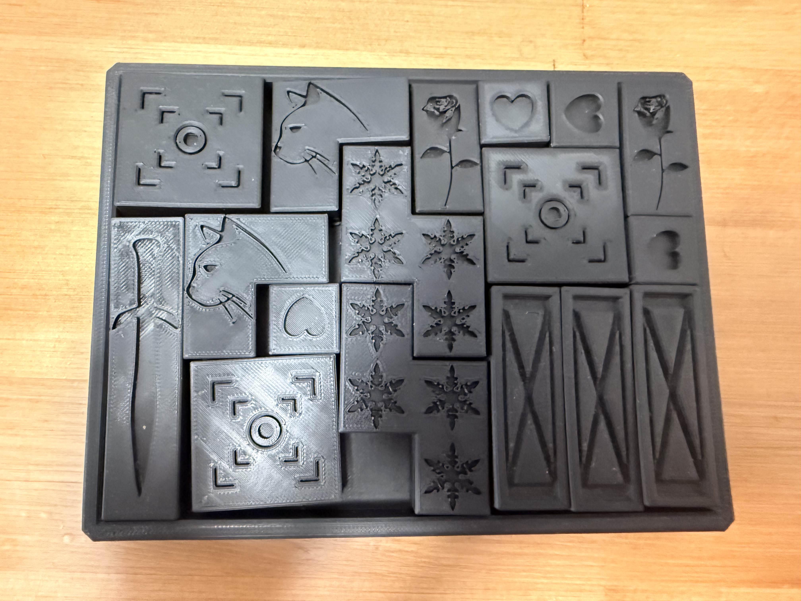
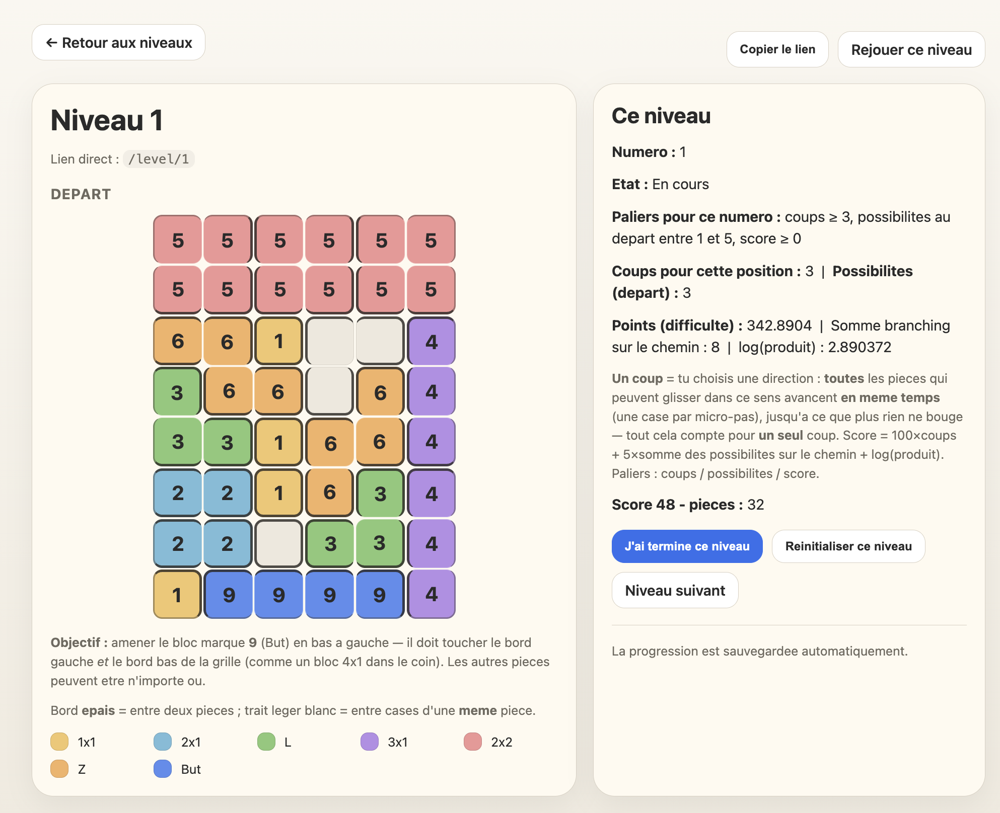

# Jeu pour Papa

Petit jeu de puzzle physique (glissade parallèle de pièces sur un plateau) accompagné d'un serveur web qui affiche, pour chaque niveau, le *pattern* à reproduire et permet de suivre la progression du joueur.

> Une photo du jeu assemblé est disponible dans le dépôt : [`photo-jeu-papa.jpg`](photo-jeu-papa.jpg).



> Un aperçu de l'application web présentant le niveau 1 est également disponible dans le dépôt : [`jeu-papa-niveau-1.png`](jeu-papa-niveau-1.png).



## Contenu du projet

Ce dépôt contient **deux volets complémentaires** :

1. **Les fichiers Autodesk Fusion (`.stl`)** — l'ensemble des pièces du jeu (plateau + blocs coulissants), prêtes à être imprimées en 3D.
2. **L'application web** (`papa_cursor_app_v2.py` + `levels.json`) qui affiche les niveaux, les règles, et sert d'interface de jeu / de suivi de progression.

> Les modèles ont été dessinés dans **Autodesk Fusion** et exportés au format `.stl`.

## Impression 3D

Dans mon cas, le jeu a été imprimé sur une **imprimante Prusa**, avec le logiciel **PrusaSlicer** pour la préparation des fichiers (`.stl` → `.gcode`). Les pièces ne comportent rien de spécifique à Prusa : elles peuvent être imprimées sur **la majorité des imprimantes 3D** grand public (Bambu Lab, Creality/Ender, Anycubic, etc.) avec n'importe quel slicer (PrusaSlicer, Cura, Bambu Studio, OrcaSlicer…).

Réglages recommandés (à adapter) :

- Matière : PLA
- Hauteur de couche : 0.2 mm
- Remplissage : 15–20 %
- Supports : non nécessaires pour la majorité des pièces
- Plateau : aucune bordure ("brim") requise en principe

> **Astuce (aimants, optionnel)** : dans mon cas, j'ai choisi d'insérer de petits aimants au centre de chaque pièce. J'ai configuré PrusaSlicer pour que l'imprimante fasse une pause à mi-parcours afin de me permettre d'insérer les aimants, puis reprenne l'impression. Les pièces sont ainsi attirées vers le plateau, ce qui rend le jeu plus agréable. C'est une option, **ce n'est absolument pas essentiel**.

## Comment utiliser le projet

Le jeu combine une **partie physique** (imprimée en 3D) et une **partie web** (les niveaux à reproduire) :

1. **Déployer l'application web sur un serveur.**
   Dans notre cas, nous avons utilisé **Railway** : <https://jeupapa-production.up.railway.app/level/1>
   *(Tout autre hébergeur Python fait l'affaire : Render, Fly.io, un VPS, ou simplement un lancement local — voir plus bas.)*
2. **Imprimer toutes les pièces** à partir des fichiers `.stl` fournis (plateau + blocs).
3. **Jouer !** Ouvrir l'URL du site, choisir un niveau, et suivre les règles ci-dessous.

## Règles du jeu

1. **Reproduire le *pattern*** (disposition de départ) décrit sur le site web pour le niveau en cours.
2. **Faire glisser les pièces** sur le plateau **sans les soulever** (déplacements horizontaux/verticaux uniquement, pièce par pièce) jusqu'à ce que **la pièce 4×1 touche le coin inférieur gauche** du plateau.
3. Niveau résolu → **passer au numéro suivant** !

## Lancer l'application en local

```bash
python3 papa_cursor_app_v2.py
```

Le jeu écoute sur `http://127.0.0.1:8000`. Depuis le même Wi-Fi, il affiche aussi une URL `http://<ip-locale>:8000` utilisable depuis un téléphone ou une tablette.

## Régénérer les niveaux

```bash
rm -f levels.json && PAPA_FORCE_REBUILD_LEVELS=1 python3 papa_cursor_app_v2.py
```

## Fichiers

- `papa_cursor_app_v2.py` — serveur HTTP + logique du jeu + générateur de niveaux (BFS).
- `levels.json` — niveaux pré-calculés (régénérés automatiquement si leur signature ne correspond plus au code).
- `papa_puzzle_progress.json` — progression locale du joueur (**non commité**).
- `requirements.txt` — dépendances Python.
- `railpack.json` — configuration de déploiement Railway.
- `*.stl` — pièces imprimables en 3D (plateau + blocs du jeu), exportées depuis Autodesk Fusion.
- `photo-jeu-papa.jpg` — photo du jeu imprimé et assemblé.
- `jeu-papa-niveau-1.png` — capture d'écran de l'application web présentant le niveau 1.
